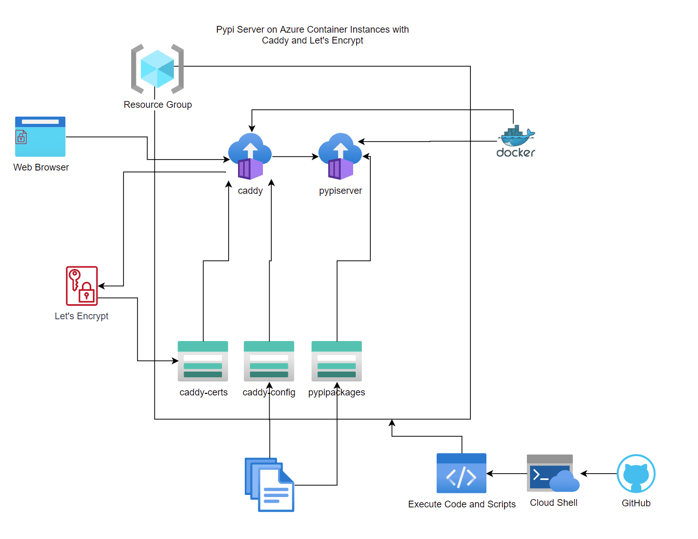
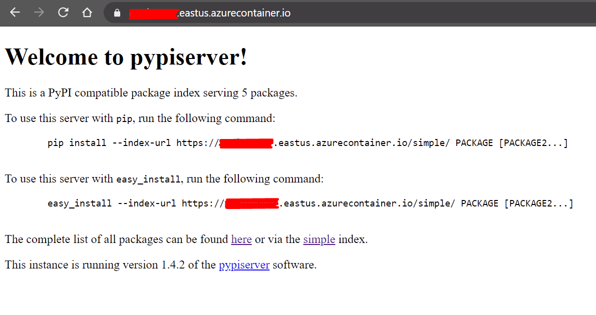
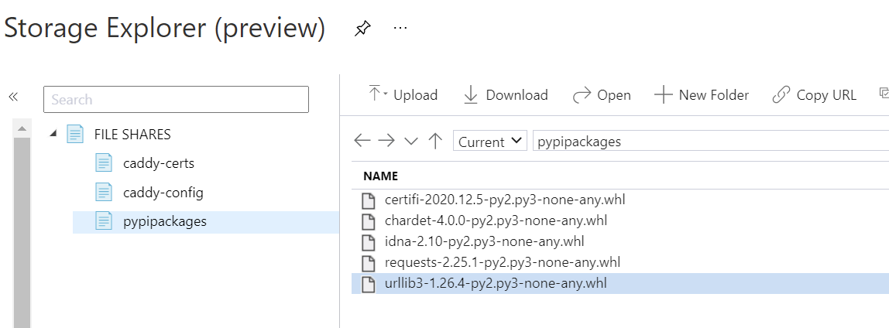
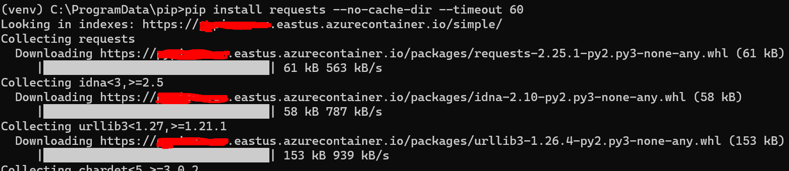

# Private PyPi Server with SSL on Azure Container Instance

This repo contains all of the tools, references and deployment scripts you need to get a private PyPi server running on Azure using Azure Container Instances with SSL by using Caddy as a web-server and reverse-proxy to serve out Let's Encrypt certificates. All of this will be backed by Azure File Shares in your storage account.

- [Caddy](https://caddyserver.com/) | [dockerhub](https://hub.docker.com/_/caddy?tab=description)
- [pypiserver Github](https://github.com/pypiserver/pypiserver) | [dockerhub](https://hub.docker.com/r/pypiserver/pypiserver)



## Pre-Requisites

Familiarity with:

- Docker
- YAML
- Azure Container Instances (ACI)
- Azure CLI / Cloud Shell
- Git

## Getting Started

All commands below will be done inside the Azure Cloud Shell.

The very first thing we need is to clone this repository.

**Clone the repo and cd into it**

``` bash
git clone https://github.com/nelsonic1/aci-pypi-ssl-deploy.git

cd aci-pypi-ssl-deploy/
```

### Subscriptions

If your Azure tenant has multiple subscriptions, ensure you are in the correct subscription before proceeding.

**Check current Subscription**

``` bash
az account show --output table
```

**List all subscriptions**

```bash
az account list --output table
```

**Switch to a different subscription**
```bash
az account set --subscription "My Subscription"
```

### Environment Variables

First, we'll set some environment variables so we don't need to keep repeating ourselves. Even if you skip some of the steps below because you already have resources you want to use, you should still edit and set these environment variables to the values you want to use.

**Set Environment Variables**

``` bash
export resourceGroupName="pypi-server-rg"
export locationName="eastus"

export storageAccountName="pypi-server$RANDOM"
export storageAccountKey=""

export containerGroupName="pypi-with-ssl"
```

### Resource Groups

Next, we need a resource group to deploy your Container Group and Storage Account to.

**Create a Resource Group**

``` bash
az group create --name $resourceGroupName --location $locationName
```

**List Resource Groups**

``` bash
az group list
```

### Storage Accounts

Our Caddy and Pypiserver containers will need some Azure File Shares to hold certificates, configuration and Python packages. These will all get mounted into their respective containers when we create the Container Group.

**Create Storage Account**

``` bash
az storage account create \ 
    --resource-group $resourceGroupName \
    --name $storageAccountName \
    --location $locationName \
    --kind FileStorage \
    --sku Premium_LRS \
    --enable-large-file-share \
    --min-tls-version TLS1_2 \
    --allow-blob-public-access false \
    --output none
```

**Get Storage Account Keys**

Once we create the Storage Account, we need the keys to be able to create File Shares and access them programmatically.

``` bash
export storageAccountKey=$(az storage account keys list \
    --resource-group $resourceGroupName \
    --account-name $storageAccountName \
    --query "[0].value" | tr -d '"')
```

**Create the Needed File Shares**

We're going to create 3 shares, each at 100GB which should be plenty to store all of the things we need but feel free to increase or leave at the minimum of 100GB.

- `caddy-certs` will contain any certificates generated by Let's Encrypt so they are persisted and we don't bump into the monthly cap of 50 free certificates.
- `caddy-config` will contain any configuration automatically generated by Caddy on startup. We could also generate a caddy file (see the caddy documentation) and put it here for it to be mounted into the container.
- `pypipackages` will contain all Python Wheel files that we download from Pypi. These could also be Wheels of packages you have developed and prepared for distribution.

``` bash
export share1="caddy-certs" share1sizeGB=100
export share2="caddy-config" share2sizeGB=100
export share3="pypipackages" share3sizeGB=100

az storage share-rm create \
    --resource-group $resourceGroupName \
    --storage-account $storageAccountName \
    --name $share1 \
    --quota $share1sizeGB \
    --enabled-protocols SMB \
    --output none
    
az storage share-rm create \
    --resource-group $resourceGroupName \
    --storage-account $storageAccountName \
    --name $share2 \
    --quota $share2sizeGB \
    --enabled-protocols SMB \
    --output none
    
az storage share-rm create \
    --resource-group $resourceGroupName \
    --storage-account $storageAccountName \
    --name $share3 \
    --quota $share3sizeGB \
    --enabled-protocols SMB \
    --output none\
    --access-tier Premium
```

### Container Group Deployment

First, we will need to update the file `aci-pypi-ssl-deploy.yaml`. Azure Cloud Shell has a number of editors built in such as `nano` and `vi` so feel free to use what you're comfortable with. You will need to change a number of things as marked inside the file. Basically anything that says 'your' should be replaced and everything else should remain untouched.

**Edit the Deployment File**

This is where your environment variables will come in handy. 

``` bash
echo $storageAccountName $storageAccountKey
# copy the values above as we'll use them in the deploy script

nano deploy-aci-ssl-pypi.yaml
```

**Create the Container Group**

``` bash
az container create --resource-group $resourceGroupName --file deploy-aci-ssl-pypi.yaml
```

**List Container Groups Available**

``` bash
az container list --resource-group $resourceGroupName
```

### Cleanup

**Delete the Container Group**

``` bash
az container delete --name pypi-with-ssl --resource-group $resourceGroupName
```

**Delete the Storage Account**

``` bash
az storage account delete --resource-group $resourceGroupName --name $storageAccountName
```


## Pypiserver

Now that we have our Container Group up and running in ACI, we can check to see if it the web interface deployed by the pypiserver container is live and served out securely using HTTPS.

Open a web browser and enter your Fully Qualified Domain Name (fqdn). This can be found inside the Azure Portal under 'Container Instances > Overview' or with the below command

``` bash
az container show --resource-group $resourceGroupName --name $containerGroupName --query 'ipAddress.fqdn' --output tsv
```

If it is successful, you will see the screen below and you should notice a Lock icon in the address bar if the site is being served out securely. This means that Caddy has gotten valid certificates from Let's Encrypt and you should also be able to see them in the `caddy-certs` File Share.



**Downloading and Uploading Packages**

To download packages off of pypi.org to serve up on your own private pypi, all you need to run is:

``` bash
pip download requests --timeout 60
```

If you want to download for a specific version of Python use the following:

``` 
pip download requests --timeout 60 --python-version 3.7.3 --only-binary=:all:
```

These packages (`.whl` files) can then be uploaded to your `pypipackages` File Share in Azure. A restart of the Pypi container may be required for the packages to be reflected in the index.



**Pip Client Configuration**

You can view where pip is looking for and using for your configuration on your platform (Win/Mac/Linux) by running:

``` bash
pip config list -v
```

On Windows you will need to add this content below to a file named `pip.ini` in `C:\ProgramData\pip\pip.ini`. Note that this directory and file may not exist and may need to be created.

``` bash
[global]
index-url = https://yourdnsnamelabel.eastus.azurecontainer.io/simple/
```


**Installing Packages**

Note that the `--timeout` option is useful if you are getting dropped connections. Depending on how much CPU and Memory you allocated to your `pypiserver` container, it may take longer than the default 15 seconds. If you would like, you can change the CPU to 4 and Memory to 4 and it will likely perform much better.

``` bash
pip install requests --no-cache-dir --timeout 60
```



## References

<https://docs.microsoft.com/en-gb/azure/container-instances/container-instances-quickstart>

<https://docs.microsoft.com/en-gb/azure/container-instances/container-instances-multi-container-yaml>

<https://docs.microsoft.com/en-gb/azure/container-instances/container-instances-volume-azure-files>

<https://docs.microsoft.com/en-gb/azure/container-instances/container-instances-get-logs>

<https://docs.microsoft.com/en-gb/azure/container-instances/container-instances-container-group-ssl>

<https://docs.microsoft.com/en-gb/azure/storage/files/storage-how-to-use-files-cli>

<https://itnext.io/automatic-https-with-azure-container-instances-aci-4c4c8b03e8c9>

<https://hub.docker.com/r/pypiserver/pypiserver>

<https://hub.docker.com/_/caddy>

<https://www.antstack.io/blog/how-to-enable-tls-for-hasura-graphql-engine-in-azure-caddy/>

<https://github.com/antstackio/azure-hasura-caddy-arm-template>

<https://docs.microsoft.com/en-us/azure/container-instances/container-instances-reference-yaml>

<https://github.com/pypiserver/pypiserver#behind-a-reverse-proxy>

<https://caddyserver.com/docs/caddyfile/directives/reverse_proxy>

<https://docs.docker.com/cloud/aci-integration/>
